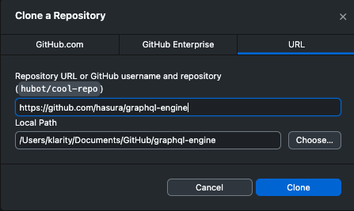

# Creating a New Project

Gerring started quickly with a new project.

## 1. Clone the Boilerplate

* Open [the boilerplate repo](https://github.com/kasparpalgi/svelte-hasura-boilerplate)
* At the top right of the list of repo's files/folders click the green "Code" button and from the dropdown menu "Open with GitGub Desktop"

[Start cloning](CreateNewProject.md)

* Allow it to open the GitHub desktop and see if the local path is where you want to clone (download) the repository. Then click the "Clone" button and you're done.



## 2. Open the project, test & install

* `CMD/CTRL + SHIFT + A` in the GitHub desktop will open the project in the VSCode
* In the terminal first run `npx playwright test` and see that playwright works. It shall open for a short period a Chrome instance, close it and display in the terminal a green success: "1 passed". If it prompts that Playwright not installed and asks for confirmation then hit ENTER.
* Install the project `npm run i` and run the dev server `npm run dev`. Now you shall see "Hello world" when you open [localhost:5173](http://localhost:5173/) in your browser.

## 3. Understanding the file structure

```
your-project/
├── src/
│   ├── routes/        ← your pages live here
│   │   └── +page.svelte   ← the home page where you saw "Hello World"
│   └── lib/           ← reusable bits (buttons, forms, etc.)
├── static/            ← images, fonts & other static files
├── .env               ← your secret keys (API keys, passwords)
└── package.json       ← the list of Node packages your project uses
```

**`src/routes/`** is where you will spend most of your time. Each file here is a page. A file called `+page.svelte` inside a folder named `about` becomes the `/about` page in your browser. You do not have to configure routing — the folder structure is the route.

**`src/lib/`** is where you store things you reuse across pages — a header component, a button style, a helper function. Think of it as a shared drawer.

**`static/`** is for files that go out to the browser exactly as they are — a logo image, a favicon, a PDF. Drop a file here and reference it as `/your-file.png` from anywhere in the app.

A `.svelte` file is just HTML and a little JavaScript (well TypeScript that is just a type safe JavaScript). All in one file. You do not need to know how to write it — Claude will write it for you. But if you open one it will look familiar: tags like `<h1>`, `<button>`, `<p>`. A typical `.svelte` file looks like this:

```svelte
<script lang="ts">
  // logic goes here — variables, functions, data fetching
  let count = 0;
</script>

<div class="p-4 text-center">
  <h1 class="text-2xl font-bold">Hello</h1>
  <button class="bg-blue-500 text-white px-4 py-2 rounded" onclick={() => count++}>
    Clicked {count} times
  </button>
</div>
```

`<script>` at the top holds the logic. The HTML below it is the visual part. Notice there is no `<style>` block at the bottom — instead of writing CSS manually we use **Tailwind** classes directly on the elements (like `text-2xl` (2x text size), `font-bold`, `bg-blue-500` (background blue)). Tailwind is a library of ready-made style classes so you describe how something looks right where the element is, without switching to a separate file.