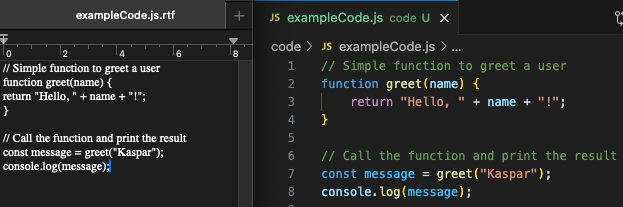
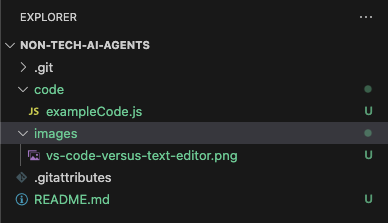
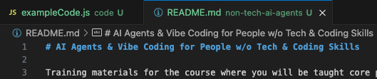
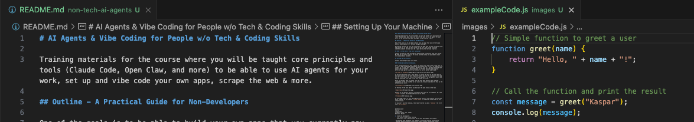
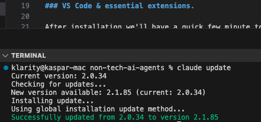

# AI Agents & Vibe Coding for People w/o Tech & Coding Skills

Training materials for the course where you will be taught core principles and tools (Claude Code, Open Claw, and more) to be able to use AI agents for your work, set up and vibe code your own apps, scrape the web & more.

## Outline - A Practical Guide for Non-Developers

One of the goals is to be able to build your own apps that you currently pay monthly subscriptions for. Without being a developer.

During the learning we will be listing all the apps that you are currently using and paying for or want to start using and we will pick as the first app something simpler and what will be a good during the learning progress.

## PART I — The Shift: From User to Builder

I know, you want to jump straight to the building process but hold your horses. We need to do just a tiny bit of boring one-time setup and you need to learn very simple basic concepts.

## Setting Up Your Machine

Install and configure your core tools.

### VS Code & essential extensions. 

After installation we'll have a quick few minute tour how to use it and what is it. 

#### What is VSCode IDE?

It is IDE (integrated development environment) but it isn't as complex as it sounds. It is super easy actually. Think of it just as a bit more advanced text editor (Mac's TextEdit / Win's Notepad). It formats the code and displays different code parts in different colors for you to better understand. 

#### File Explorer

It has also multiple areas. Text editor is taking the most of the area but you have also usually in the left "Explorer" where you see the collapsible tree and all the files/folders of the currently open project. You can quickly search and open by searching file name or any text inside all files.

Files and folders that are green, are the ones that haven't been commited (uploaded) to the Git (GitHub in our case) yet. We will come back to this in the GitHub section later.

In the top of the text editor you have all the open files in the tabs.

From the file explorer you can just click to open a new file as a new tab in the text editor part but you can also drag'n'drop the new (or the same file) into the text editor's left or right half of the text and it will open side-by-side. Super handy!

#### Terminal

Usually at the bottom, there is a terminal where you can run commands. Eg. type `claude` to start the Claude Code once we're there.

On the image, above is text editing part and below is the terminal where I have given command, as an example, `claude update` to update my Claude Code to the latest version.

If you can't see the terminal, then take from the top menu `Terminal` the first item `New Terminal`.

Same way like you can have in multiple files open above, you can have multiple terminals side by side. Move your mouse to the top right of your terminal window and click the chewron down on the right side of the + icon, pick `Split Terminal` and choose your favourite terminal (eg. `zsh` on Mac).

## GitHub

1. [Create your Github account](https://github.com/signup) if you don't have one already.
2. 
