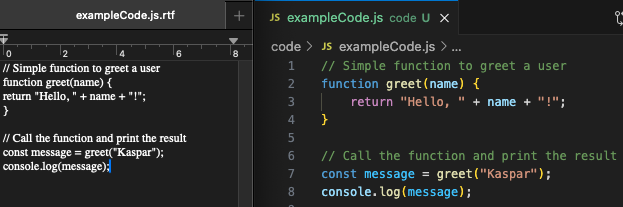
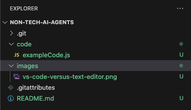
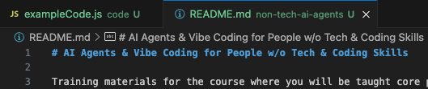
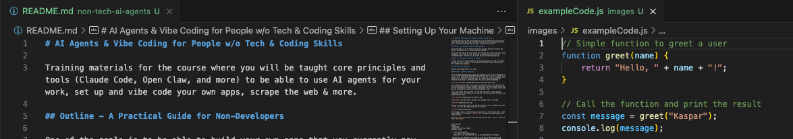
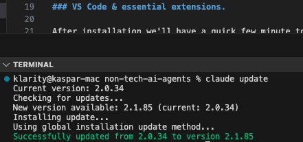
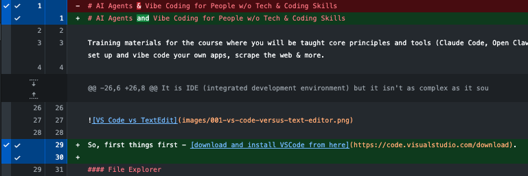
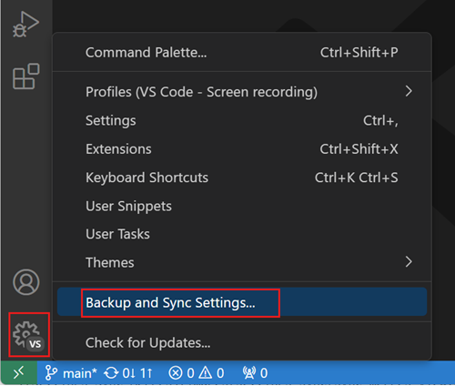

# AI Agents and Vibe Coding for People w/o Tech and/or Coding Skills

Training materials for the course where you will be taught core principles and tools (Claude Code, Open Claw, and more) to be able to use AI agents for your work, set up and vibe code your own apps, scrape the web & more.

## Outline - A Practical Guide for Non-Developers

One of the goals is to be able to build your own apps that you currently pay monthly subscriptions for. Without being a developer.

During the learning we will be listing all the apps that you are currently using and paying for or want to start using and we will pick as the first app something simpler and what will be a good during the learning progress.

## PART I — The Shift: From User to Builder

I know, you want to jump straight to the building process but hold your horses. We need to do just a tiny bit of boring one-time setup and you need to learn very simple basic concepts.

## Setting Up Your Machine

Install and configure your core tools. A fully working development environment and understanding the the dev env without becoming a dev in under an hour.

### VS Code & essential extensions. 

After installation we'll have a quick few minute tour how to use it and what is it. 

#### What is VSCode IDE?

It is IDE (integrated development environment) but it isn't as complex as it sounds. It is super easy actually. Think of it just as a bit more advanced text editor (Mac's TextEdit / Win's Notepad). It formats the code and displays different code parts in different colors for you to better understand. 



So, first things first - [download and install VSCode from here](https://code.visualstudio.com/download).

#### File Explorer

It has also multiple areas. Text editor is taking the most of the area but you have also usually in the left "Explorer" where you see the collapsible tree and all the files/folders of the currently open project. You can quickly search and open by searching file name or any text inside all files.

Files and folders that are green, are the ones that haven't been commited (uploaded) to the Git (GitHub in our case) yet. We will come back to this in the GitHub section later.



In the top of the text editor you have all the open files in the tabs.



From the file explorer you can just click to open a new file as a new tab in the text editor part but you can also drag'n'drop the new (or the same file) into the text editor's left or right half of the text and it will open side-by-side. Super handy!



#### Terminal

Usually at the bottom, there is a terminal where you can run commands. Eg. type `claude` to start the Claude Code once we're there.



On the image, above is text editing part and below is the terminal where I have given command, as an example, `claude update` to update my Claude Code to the latest version.

If you can't see the terminal, then take from the top menu `Terminal` the first item `New Terminal`.

Same way like you can have in multiple files open above, you can have multiple terminals side by side. Move your mouse to the top right of your terminal window and click the chewron down on the right side of the + icon, pick `Split Terminal` and choose your favourite terminal (eg. `zsh` on Mac).

## GitHub

Git is the standard version controlling (what?) today. The main benefit for you is to see what your agent (or you or your collegue/friend) has changed and either approve it, improve it or roll it back if you think it's no good and shall be done from scratch. Simple view:



On the image above you can see that on the first line red is what was before and the green below what it was changed to. `&` in the middle of that changed line has a slightly lighter red background and below the `and` has slightly greener background so it is quick to visually identify that in the first line just the `&` was corrected to `and`.

Then you can see many lines skipped as no changes there and lines 29 & 30 were added. Line 29 some text and line 30 just an empty line.

Now you can decide if that change was fine or not. That's the main core idea of the Git so let's learn more by doing.

### First steps

1. To, use GitHub, you'll need to first [download & install Git](https://git-scm.com/install/). 
2. [Create your Github account](https://github.com/signup) if you don't have one already.
3. Click "Star" and "Follow" in the top right of [this course in GitHub](https://github.com/kasparpalgi/non-tech-ai-agents) the be up to date of any new content.
4. [Download & install GitHub Desktop](https://desktop.github.com/download) in your machine.
5. Once  installed it will offer you to login. Do that.
6. Go back to VSCode as you can now use your GitHub account to login so all your VScode settings, extensions and preferences will be synced when you re-install on a new computer: . If the image isn't enought then [here is the detailed instructions](https://code.visualstudio.com/docs/configure/settings-sync).
7. Click "Extensions" in the top left icon tabs and install [VSCode extensions](VScodeExtensions.md)
8. Download & Install [NodeJS](https://nodejs.org/en/download). Needed to run Claude Code, many other tools we'll be using, and for the vibe coded apps to run locally.
9. Finally install Claude Code from your terminal window on Mac/Linux: `curl -fsSL https://claude.ai/install.sh | bash` & on Win: `irm https://claude.ai/install.ps1 | iex`

## Claude Code: CLI, Desktop, or Extension?

After installing Claude Code you will notice there are actually three ways to run it. Here is the quick comparison so you know what to pick.

| | CLI (terminal) | Desktop app | VS Code extension |
|---|---|---|---|
| Where it lives | Inside VS Code's terminal | Its own window | Sidebar panel in VS Code |
| Best for | This course | Complete beginners | Quick questions while coding |
| Needs terminal? | Yes | No | No |

**Which should you use?** Stick with the **CLI in your VS Code terminal**. Here is why:

- You already have VS Code open with the file explorer on the left and the terminal at the bottom — Claude Code slots right in.
- You will be running other terminal commands anyway (starting your app, installing packages), so the terminal is not extra effort, it is the same place you are already working.
- The CLI gives you the most control and is what most vibe coders use.

The **Desktop app** is a fine choice if you find the terminal intimidating at first — it is a proper window you open like any other app and you can point it at your project folder. There is no wrong answer; you can always switch later.

The **VS Code extension** is handy for quick questions ("what does this function do?") without leaving your editor, but for building whole features the CLI or Desktop app is better suited.

### MCP

MCP stands for **Model Context Protocol** — think of them as plugins or add-ons for Claude Code. By default Claude can only see the files in your project. With MCPs you hand it new abilities: searching the web, opening a real browser, reading your calendar, and more.

You install an MCP once per machine (or once per project) and after that Claude just uses it automatically when it makes sense.

#### How to install an MCP

You run one command in your VS Code terminal and Claude Code saves it for future sessions. Most MCPs need Node.js installed (you already did that in the setup steps above).

#### Brave Search — let Claude search the web

This is the most useful first MCP. Without it Claude only knows what is in your project files and its own training data. With Brave Search it can look things up on the internet mid-conversation.

1. Go to [brave.com/search/api](https://brave.com/search/api/) and sign up for a free API key (the free tier is generous — 2 000 searches/month).
2. Copy your API key, then run this in your terminal (replace `your_key_here` with the real key):

```
claude mcp add brave-search -e BRAVE_API_KEY=your_key_here -- npx -y @modelcontextprotocol/server-brave-search
```

Now you can say things like *"search for the latest pricing of Vercel"* and Claude will go look it up.

#### Playwright — let Claude control a browser

Playwright is a tool that drives a real browser — it can open pages, click buttons, fill in forms, and take screenshots, all on its own. This is useful for testing your app, scraping a website, or automating repetitive web tasks.

```
claude mcp add playwright -- npx -y @playwright/mcp@latest
```

After installing you can ask Claude things like *"open my app at localhost:3000 and take a screenshot"* or *"go to this page and fill in the sign-up form with test data"*.

#### GitHub — create issues, open PRs, and read comments

> **Wait — can't Claude just use git commands?** Yes. Claude Code can already run `git log`, `git commit`, `git diff`, and any other git command directly in your terminal without any MCP. You don't need an MCP to see your commit history or make a commit.
>
> The GitHub MCP adds something different: it talks to the **GitHub website** via its API. That means Claude can open a pull request, post a comment on an issue, or list all open issues — things that live on GitHub.com, not in your local files.

If you want Claude to interact with GitHub.com (not just local git), here's how:

1. Go to [github.com/settings/tokens](https://github.com/settings/tokens) and create a Personal Access Token (choose "classic", tick `repo` scope).
2. Run:

```
claude mcp add github -e GITHUB_TOKEN=your_token -- npx -y @modelcontextprotocol/server-github
```

Now you can say *"create an issue titled 'Login button broken' in my repo"* and Claude will do it.

#### Other useful MCPs

| MCP | What it does | Install command |
|---|---|---|
| **Notion** | Read and write your Notion pages and databases | `claude mcp add notion -e NOTION_API_KEY=your_key -- npx -y @modelcontextprotocol/server-notion` |
| **Slack** | Send messages and read channels | `claude mcp add slack -e SLACK_BOT_TOKEN=your_token -- npx -y @modelcontextprotocol/server-slack` |

You can see all your installed MCPs at any time by running:

```
claude mcp list
```

And remove one you no longer want:

```
claude mcp remove brave-search
```

Outcome: Claude is no longer limited to your project files — it can search the web, browse real pages, manage GitHub, and connect to the tools you already use daily.

## Skills — Saved Recipes for Claude

Think of a **skill** as a saved recipe. You write down a set of instructions once — for example, "when I say `/standup`, look at what changed since yesterday and draft a three-sentence update I can paste into Slack" — save it, and from then on you just type `/standup` and Claude follows the recipe automatically.

In Claude Code, skills are stored as short text files in a `.claude/skills/` folder inside your project (or in a global folder that applies to every project on your machine). You can:

- **Use built-in skills** that ship with Claude Code — type `/` in the prompt to see the full list.
- **Create your own** by adding a small text file with a name, a one-line description, and the instructions.

### Creating your first skill

1. Inside your project, create the folder `.claude/skills/` if it doesn't exist yet (you can do this right in the VS Code file explorer).
2. Create a new file called `daily-standup.md` inside that folder and paste this in:

```
---
name: daily-standup
description: Summarise what changed in the project since yesterday and draft a short standup update.
---

Look at the git log from the last 24 hours. List the key changes in plain English.
Then write a 3-sentence standup update I can paste into Slack.
```

3. Type `/exit` to close Claude Code and reopen it.
4. Type `/daily-standup` — Claude now runs that recipe every time you use it.

You can share this file with collaborators by committing it to GitHub. Anyone who clones the repo gets the skill automatically with no extra setup.

Outcome: You capture any repeatable workflow as a skill and stop explaining the same instructions to Claude over and over.

---

## Subagents — Helpers That Work in the Background

When you ask Claude something, it thinks step by step in one continuous thread — like reading a long book from front to back. A **subagent** is a fresh, separate thread that Claude spins up to handle a specific task on its own, then reports back with a summary before disappearing.

Think of it this way: you are the manager, Claude is your assistant, and the subagent is a contractor your assistant hires for one job. The contractor goes off, does the work, and comes back with a report. You never have to watch them work.

### When does this matter?

Say you ask Claude: *"Read all 40 files in this project and write a summary of each."* If Claude reads all 40 files itself in one thread, it can start to lose track of earlier files by the time it reaches the last ones — its working memory fills up. Instead, it can spin up a subagent per file — each one reads a single file, writes a summary, and exits. The main Claude collects all the summaries at the end.

You do not have to do anything special to trigger this. Claude decides on its own when subagents make sense. But knowing it exists means you can write better prompts for big tasks:

> *"Work through this in parallel — delegate the research to subagents and give me a combined summary at the end."*

Outcome: Big tasks that would overwhelm a single session get split up automatically, and you get a clean summary without the noise.

---

## Agent Teams — Multiple Claudes Working Together

A subagent does one job and stops. An **agent team** is different: it is a group of Claude sessions that keep running, share a task list, and can send messages to each other.

Picture three people sitting at three computers, all in the same group chat. One is researching, one is writing, one is reviewing. They talk to each other, hand off work, and anyone can update the shared list. That is roughly what agent teams do:

- **Shared tasks** — all agents see the same to-do list and can tick things off.
- **Peer messages** — one agent can ask another a question or hand it a piece of work.
- **Independent loops** — each agent runs its own loop, so they genuinely work in parallel.

### When would you use this?

Agent teams shine for large, structured projects — for example, building a whole app where one agent designs the database, one writes the back end, and one builds the front end simultaneously.

For day-to-day tasks you probably won't need teams. But knowing they exist means you can say *"run this as a coordinated team"* when a project is genuinely large and you want things done faster.

Outcome: Tasks that would take one Claude session hours can be split across parallel agents, finishing in a fraction of the time.

---

## Hooks — Automatic Actions Outside the Conversation

A **hook** is a script that runs automatically at a fixed moment — before Claude uses a tool, after it writes a file, or when a session ends. The critical difference from everything else: Claude does not run hooks; **your computer** runs them. They happen outside the conversation, unconditionally, every single time.

Think of hooks like the automatic rules in a spreadsheet ("any time a cell in column B changes, highlight it red"). They are deterministic — they always do the same thing, no matter what.

### Common uses

| When | What the hook does |
|---|---|
| Before every file save | Runs a formatter so all your code looks tidy automatically |
| After every tool call | Logs what Claude did so you have an audit trail |
| Before a commit | Runs a quick check to catch obvious mistakes early |

### Setting up a hook

Hooks live in your Claude Code settings file (`.claude/settings.json`). Here is a simple example that logs every time Claude writes a file:

```json
{
  "hooks": {
    "PostToolUse": [
      {
        "matcher": "Write",
        "hooks": [
          {
            "type": "command",
            "command": "echo 'File written' >> .claude/activity.log"
          }
        ]
      }
    ]
  }
}
```

This says: every time Claude uses the Write tool, run that command. The result is a new line added to `activity.log` — a simple breadcrumb trail of every file Claude touched.

You do not need to understand shell scripting to use hooks. Start by copying examples others share and modifying the command to suit your needs.

Outcome: You can attach automatic guardrails, formatters, and logs to Claude's actions without writing any conversation prompts.

---

## Plugins and Marketplaces — Sharing What You Build

Skills, MCPs, and hooks are all plain files. That means you can share them the same way you share any file: put them on GitHub, zip them up, or list them in a marketplace directory.

**Marketplaces** are curated collections of ready-made extensions you can browse and install. Instead of writing your own Notion skill from scratch, you find one someone else already built, install it in one command, and you're done.

The main places to find Claude Code extensions right now:

| Directory | What you'll find |
|---|---|
| **GitHub** | Search `claude-mcp` or `claude-skills` for community packages |
| **mcp.so** | A directory of MCP servers, browseable by category |
| **Smithery** | A curated list with one-click install instructions |

### Installing from a marketplace

Most extensions follow the same pattern: you run a `claude mcp add` command (for MCPs) or copy a `.md` file into your `.claude/skills/` folder (for skills). The marketplace page shows you the exact command — there is nothing to figure out.

### Publishing your own

If you build a skill that saves you time every day, other people probably need it too. Share it by:

1. Creating a public GitHub repository with your skill files.
2. Adding a short README explaining what it does and how to install it.
3. Tagging the repo `claude-skills` so others can find it in a search.

Outcome: You are not limited to what ships with Claude Code — a whole ecosystem of ready-made extensions is waiting, and you can contribute your own when you're ready.

---

# Coming soon (raw material from here on):

* /clear and other /commands
* Clipboard tools to be a power user (e.g. CopyQ on Mac and Ditto on Win)
* Optional: Docker
* Gemini CLI

## Your First Workflow
* How modern development actually works
* Making small changes safely
* The feedback loop: edit → run → fix
  
Outcome: You understand how to work, not just what tools to use.

## Cloning Your First Boilerplate
* What a boilerplate really is
* Finding and cloning a repo using GitHub Desktop

Outcome: You now have a real project running locally.

# TODO:
* Markdown
* Web