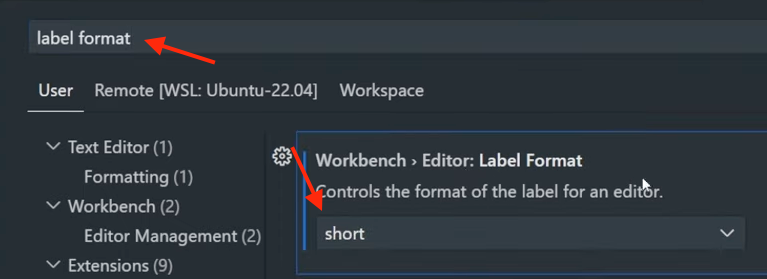

# VScode Extensions & Settings

## Install extensions

* [Svelte for VS Code](https://marketplace.visualstudio.com/items?itemName=svelte.svelte-vscode)
* Svelte Intellisense or any other needed in 2026? Search internet.
* Prettier - do I need if Svelte for VSCode installed?
* Claude Code - chat with Claude about your currently open project
* [Material Icon Theme](https://marketplace.visualstudio.com/items?itemName=PKief.material-icon-theme) - just makes the file explorer icons nicer and more intuitive.
* [Code Spell Checker](https://marketplace.visualstudio.com/items?itemName=streetsidesoftware.code-spell-checker) - if you want to make no English spelling mistakes in your codebase or project.

## Suugested settings

Open command palette to quickly open settings (or anything in VSCode): Shift + Command + P (Mac) /  Ctrl + Shift + P (Windows/Linux) and start typing "Preferences: Open User Settings". You don't need to fully type it to already see it and open it without touching the mouse.

### Set label format "short"

Type in the settings search bar: "Label Format" and set the very top Workbench > Editor: Label Format to "Short"

